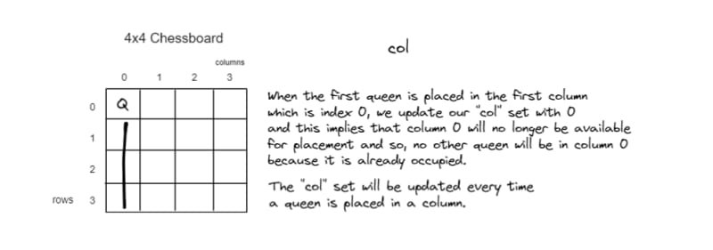

## N Queens

### Description
This is a function that solves the N queens problem.

### Example:
```python
$ ./0-nqueens.py 1
N must be at least 4

$ ./0-nqueens.py string 
N must be a number

$ ./0-nqueens.py 4
[[0, 1], [1, 3], [2, 0], [3, 2]]
[[0, 2], [1, 0], [2, 3], [3, 1]]

$ ./0-nqueens.py 6
[[0, 1], [1, 3], [2, 5], [3, 0], [4, 2], [5, 4]]
[[0, 2], [1, 5], [2, 1], [3, 4], [4, 0], [5, 3]]
[[0, 3], [1, 0], [2, 4], [3, 1], [4, 5], [5, 2]]
[[0, 4], [1, 2], [2, 0], [3, 5], [4, 3], [5, 1]]
```

### Files:
[0-nqueens.py](0-nqueens.py)

### Explanation:
The N queens problem is a puzzle that can be solved by placing N queens on an NxN chessboard such that no two queens attack each other.

The program takes in a number N and prints all possible solutions.

We start by checking if the length of arguments passed is not 2, if so we print the usage message and exit with status 1.

We then check if the argument passed is a digit, if not we print the usage message and exit with status 1.

We then check if the argument passed is less than 4, if so we print the usage message and exit with status 1.

We define a board as an empty list. We also define a `col` set, a `pos_diag` set, and a `neg_diag` set.
This sets will contain the columns, positive diagonals, and negative diagonals that are occupied by queens.

We then call the `backtrack` function with the current row set to 0, the n, the col set, the pos_diag set, the neg_diag set, and the board.



The `backtrack` function serves as a recursive function and iterates through n columns.
For each column, it checks if the column is not in the col set, or if the sum of the current row and the column is not in the pos_diag set, or if the difference of the current row and the column is not in the neg_diag set.


If any of the conditions are met, we add the column to the col set, the sum of the current row and the column to the pos_diag set, and the difference of the current row and the column to the neg_diag set.


We then append the current row and column to the board.

If the current row is equal to n - 1 (we are at the last row), we print the board and return.

If the current row is not equal to n - 1, we call the `backtrack` function again with the current row incremented by 1, the n, the col set, the pos_diag set, the neg_diag set, and the board.

After the `backtrack` function is called, we remove the column from the col set, the sum of the current row and the column from the pos_diag set, and the difference of the current row and the column from the neg_diag set.

We then pop the last element from the board.